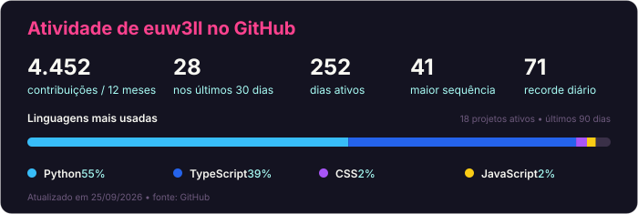

## 😉 Opa, eu sou o Well!
🎓 Técnico em Informática no Colégio Bento Quirino (2019–2021) 
📚 Formado em ADS na Universidade São Francisco (2024–2026) 
🚀 Desenvolvendo infoprodutos, SaaS e soluções low-code

---

### 🧰 Tecnologias que uso

---

### 📈 GitHub Stats

---

### 📫 Contato

- ✉️ wendrell.antoneli@gmail.com  
- 🔗 [LinkedIn](https://www.linkedin.com/in/wendrell-antoneli)  

